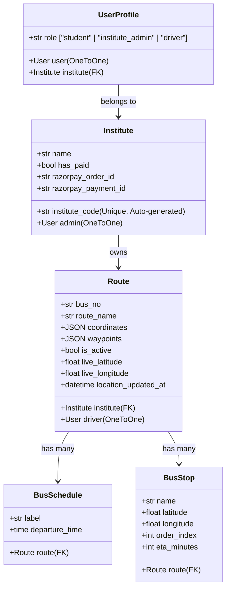

# 🚌 EduRide — Smart Institutional Transport Tracking System

EduRide is a modern, real-time school and college transport tracking system built on top of **Django 6.0**, **Tailwind CSS**, and **Leaflet.js**. It enables educational institutions to manage transport networks efficiently, while allowing drivers to stream live GPS locations and students to track their buses in real-time.

---

## 🚀 Key Features

The system supports three user roles, each with a specialized dashboard:

### 🏫 1. Institute Administrator
* **Secure Subscription Activation:** Features a secure, sandbox-ready **Razorpay Checkout** integration to activate management capabilities (one-time activation fee of ₹499).
* **Interactive Route Builder:** Visual route creation with custom waypoints, coordinates, and automated path generation using Leaflet & Leaflet Routing Machine.
* **Stop & Schedule Manager:** Add bus stops with order sequences, automatically calculating estimated travel times (ETAs) assuming an average speed of 40 km/h. Assign specific departure schedules (e.g., Morning Pickup, Evening Return).
* **Driver Assignment:** Directly pair drivers to specific bus routes.
* **Member Management:** View list of enrolled students and drivers, with administrative override to remove members from the institution.

### 🚍 2. Bus Driver
* **Route Visualization:** Interactive map displaying the active route coordinates and all registered stops.
* **Trip Controls:** Quick toggle controls to start or stop trips (`is_active` status).
* **Live GPS Broadcasting:** Dynamically sends coordinates to the server via AJAX/Fetch API at regular 5-second intervals using browser geolocation.

### 👤 Student
* **Instant Onboarding:** Sign up and instantly link to an institution using a unique generated code (e.g., `EDU-A3X7K2`).
* **Real-time Map Dashboard:** Track the live location of their assigned bus route, including current stops, next stop details, and live distance status.
* **Comprehensive Details:** View departure times and complete schedule info directly from the dashboard.

---

## 🛠️ Tech Stack

* **Backend Framework:** Django 6.0.3
* **Frontend Design:** Tailwind CSS (via `django-tailwind`), Vanilla HTML5 & CSS3
* **Map & Geolocation:** Leaflet.js, OpenStreetMap Tiles, Leaflet Routing Machine
* **Database:** SQLite3 (development)
* **Payment Integration:** Razorpay API (with test-mode billing)
* **Environment Configuration:** python-dotenv

---

## 📂 Project Architecture

The codebase is organized into modular Django applications:

```text
Transport_system/
│
├── EduRide/                   # Django Project Configuration Directory
│   ├── settings.py            # Global settings, Razorpay setup, Tailwind registry
│   ├── urls.py                # Main project routing (routing requests to apps)
│   └── wsgi.py / asgi.py      # WSGI and ASGI entry-points
│
├── student/                   # Student Application Module
│   ├── templates/             # Student dashboard, login, register, landing page templates
│   ├── urls.py                # Student views endpoints and live API paths
│   └── views.py               # Landing page, dashboard, and auth handlers
│
├── institute/                 # Institute Management Application Module
│   ├── models.py              # Models for Institute, Route, BusStop, and BusSchedule
│   ├── templates/             # Route creator, payment gateways, admin panels
│   ├── urls.py                # Route mapping for admin management actions
│   └── views.py               # Payment verifiers, route editors, member tools
│
├── driver/                    # Driver Tracking Application Module
│   ├── templates/             # Driver dashboard templates
│   ├── urls.py                # Toggle trip & live update endpoints
│   └── views.py               # Geolocation handling, dashboard views
│
└── theme/                     # Tailwind CSS Compilation Workspace
```

---

## 🗄️ Database Models Overview



---

## ⚙️ Setup & Installation

Follow these steps to run EduRide locally on your computer:

### 1. Clone & Navigate
```bash
git clone <repository-url>
cd Transport_system
```

### 2. Set Up a Virtual Environment
```bash
# Create the virtual environment
python -m venv venv

# Activate on macOS/Linux:
source venv/bin/activate

# Activate on Windows:
venv\Scripts\activate
```

### 3. Install Dependencies
```bash
pip install -r EduRide/requirements.txt
```

### 4. Configure Environment Variables
Create a file named `.env` in the `EduRide/EduRide/` directory (where `settings.py` is located) and specify your keys:
```env
DJANGO_SECRET_KEY="your-secret-key-here"
RAZORPAY_KEY_ID="rzp_test_yourKeyId"
RAZORPAY_KEY_SECRET="yourKeySecret"
```

### 5. Install and Start Tailwind CSS
Since the project utilizes `django-tailwind`, you must install its npm dependencies. Ensure you have Node.js installed on your machine.
```bash
# Navigate to the Django project base directory
cd EduRide

# Install Tailwind dependencies
python manage.py tailwind install

# Start Tailwind compilation in watch mode (keep this terminal running)
python manage.py tailwind start
```

### 6. Apply Database Migrations & Run Server
In a new terminal window (with the virtual environment activated):
```bash
cd EduRide

# Run migrations to set up database tables
python manage.py migrate

# Create a superuser to access the Django admin panel
python manage.py createsuperuser

# Start the Django development server
python manage.py runserver
```
Open your browser and navigate to `http://127.0.0.1:8000/`.

---

## 🛠️ Testing the Workflow Locally

To test the application flow from end-to-end:

1. **Register an Institute:**
   * Go to `http://127.0.0.1:8000/institute/institute_reg/signup/` and create an institute.
   * Note the generated unique **Institute Code** (e.g. `EDU-xxxxxx`) on the admin dashboard.
2. **Perform Sandbox Payment:**
   * Click the activation banner. You will be taken to the Razorpay UI.
   * Use the test card number `4111 1111 1111 1111` with any future expiry date and random CVV.
   * Upon successful payment, your admin dashboard will unlock.
3. **Configure Routes, Stops, and Schedules:**
   * Click **Add Route** to open the route creator.
   * Click points on the map to define the route waypoints.
   * Set up Bus Stops (e.g., Start Station, Stop A, Terminus) and configure a pickup schedule.
4. **Register a Driver:**
   * Go to `http://127.0.0.1:8000/driver/driver_reg/signup/` in an incognito window or separate browser.
   * Enter the **Institute Code** noted in Step 1 to register the driver under your institute.
   * In the Institute Admin panel, go to **Manage Buses** and assign this driver to your route.
5. **Register a Student:**
   * Go to `http://127.0.0.1:8000/student/student_reg/signup/`.
   * Input the **Institute Code** to enroll under the same institute.
6. **Simulate Live Tracking:**
   * Log into the **Driver Dashboard**. Click **Start Trip**. This starts updating the database with mock coordinates.
   * Log into the **Student Dashboard**. You will see the bus marker moving live on the dashboard map!

---

## 📜 License

This project is licensed under the MIT License. Feel free to use, modify, and distribute it.
